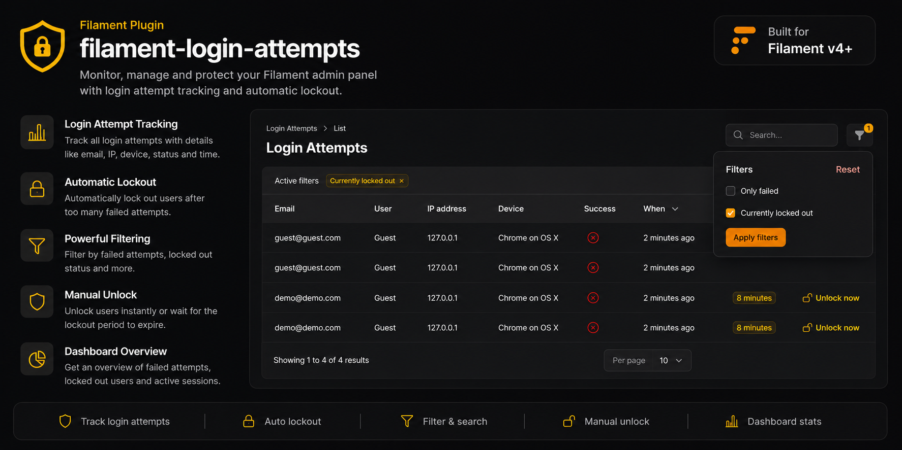

# Filament Login Attempts



[](https://packagist.org/packages/smony/filament-login-attempts)
[](https://packagist.org/packages/smony/filament-login-attempts)
[](LICENSE.md)

Log every login attempt to your Filament admin panel and lock out brute-force attackers automatically, right from your Filament admin panel.

## Requirements

- PHP 8.2+
- Filament v4

## Installation

```bash
composer require smony/filament-login-attempts
```

Publish and run the migration:

```bash
php artisan vendor:publish --tag=filament-login-attempts-migrations
php artisan migrate
```

Register the plugin in your Panel Provider:

```php
use Smony\FilamentLoginAttempts\FilamentLoginAttemptsPlugin;

public function panel(Panel $panel): Panel
{
    return $panel
        // ...
        ->plugin(FilamentLoginAttemptsPlugin::make());
}
```

## What you get

- A **Login Attempts** page listing every login attempt: email, matched user (or "Guest"), IP address, parsed device/browser, success/failure, and when it happened
- **Brute-force protection**: after a configurable number of failed attempts, the offending IP, email, or IP+email combination is locked out for a configurable duration — enforced via Laravel's `RateLimiter`, the same mechanism behind the framework's own login throttling
- A **"Currently locked out"** filter and an **"Unlock now"** action to lift a lockout early
- A **stats widget** showing failed attempts in the last 24 hours and how many keys are currently locked out
- A **`login-attempts:prune`** artisan command to delete attempts older than your retention window
- A `Smony\FilamentLoginAttempts\Events\LoginLockedOut` event, dispatched the moment a key gets locked out — listen for it in your app to send your own notification (Slack, email, etc.):

```php
use Smony\FilamentLoginAttempts\Events\LoginLockedOut;

Event::listen(LoginLockedOut::class, function (LoginLockedOut $event) {
    // $event->key, $event->email, $event->ipAddress, $event->lockedForMinutes
});
```

## Configuration

Publish the config to customize thresholds, the lockout key strategy, and retention:

```bash
php artisan vendor:publish --tag=filament-login-attempts-config
```

```php
return [
    'table' => 'login_attempts',
    'max_attempts' => 5,
    'decay_minutes' => 10,
    'lockout_minutes' => 15,
    'lockout_strategy' => 'ip_and_email', // ip | email | ip_and_email
    'retention_days' => 30,
];
```

Schedule the prune command in your app's console kernel/scheduler to keep the table from growing indefinitely:

```php
$schedule->command('login-attempts:prune')->daily();
```

## License

MIT
